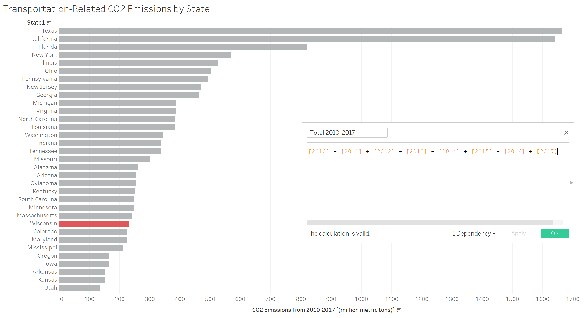
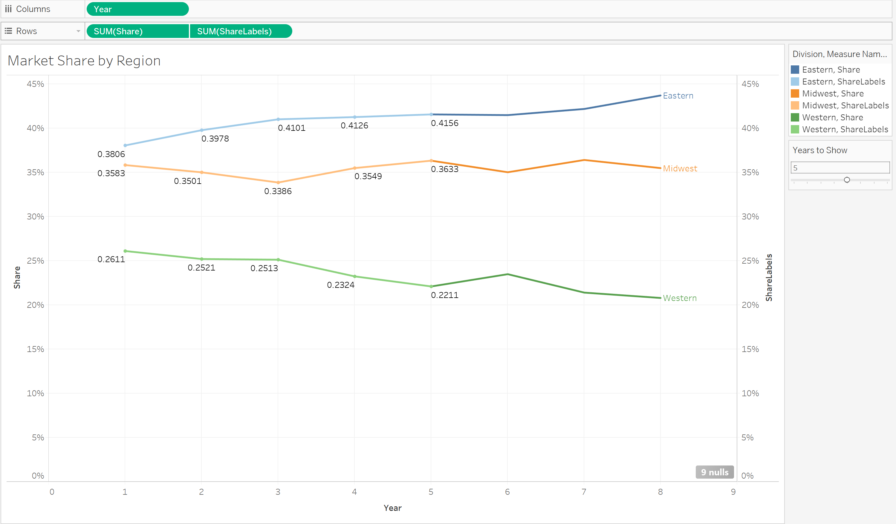
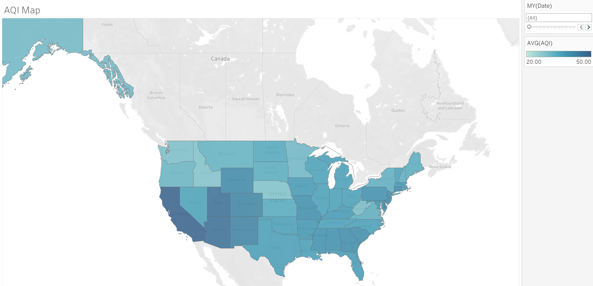
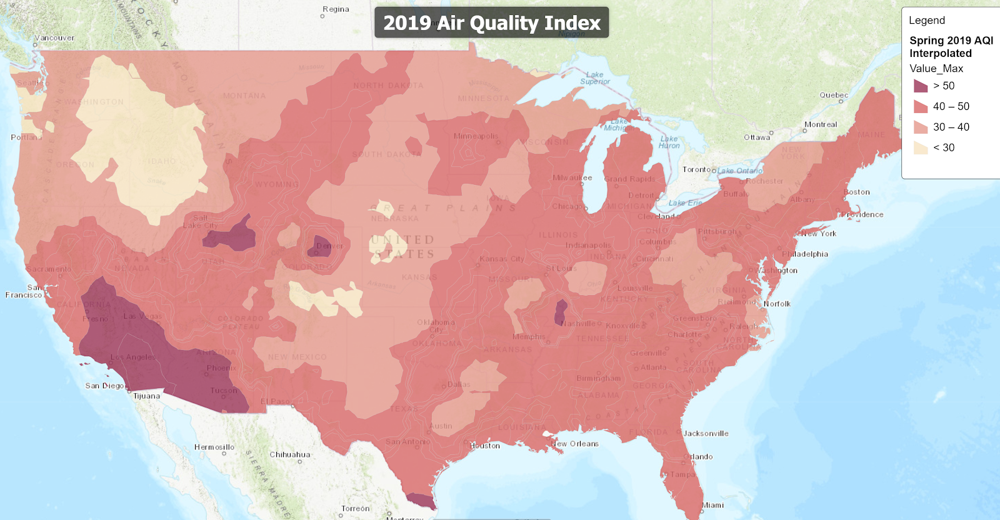
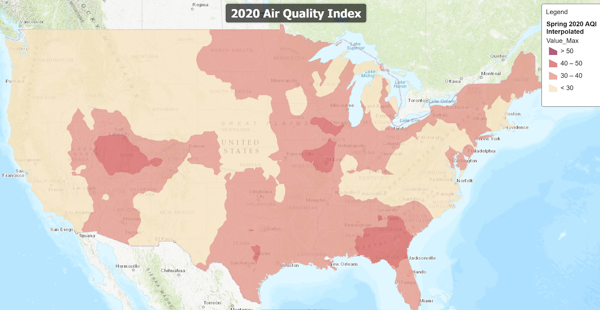
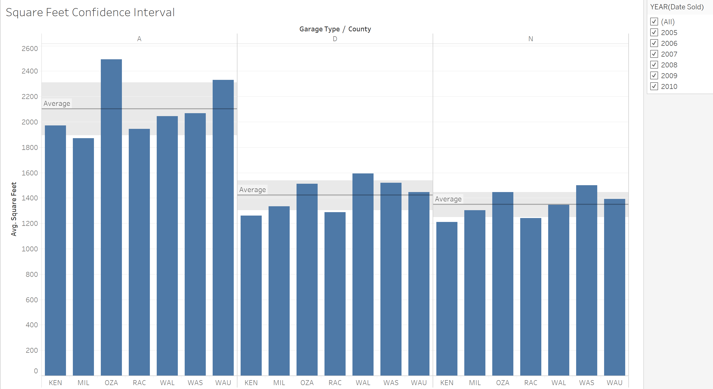
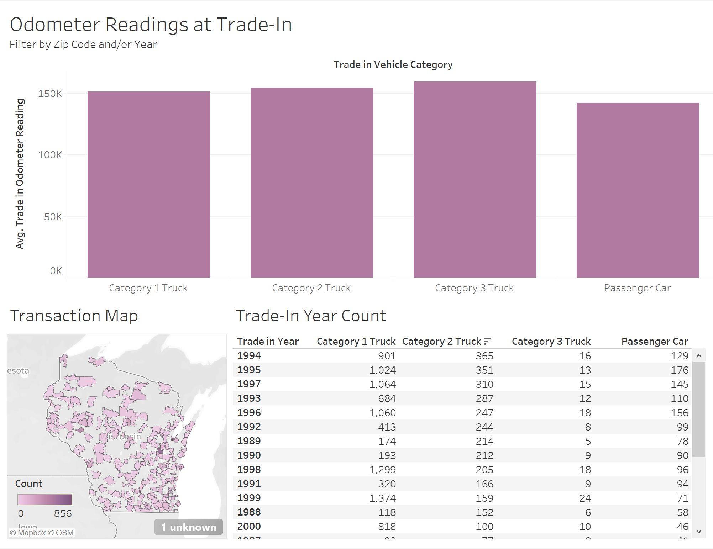
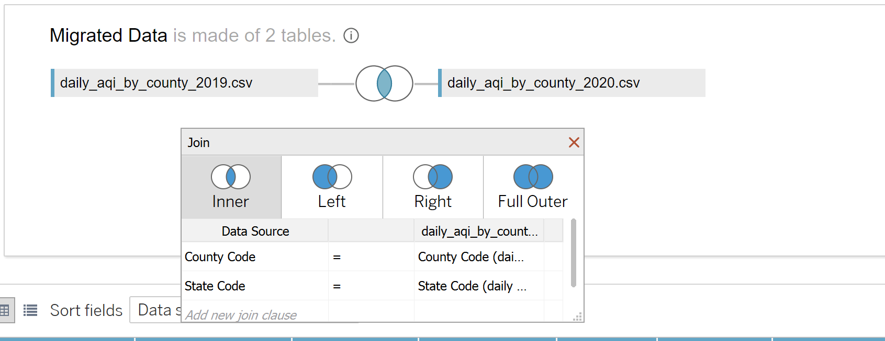
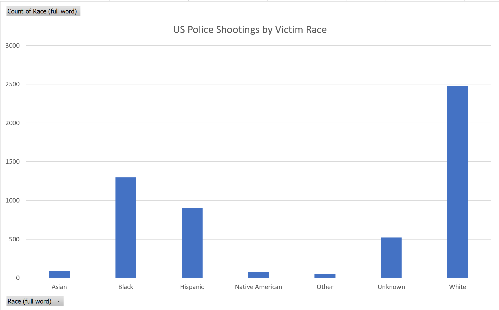
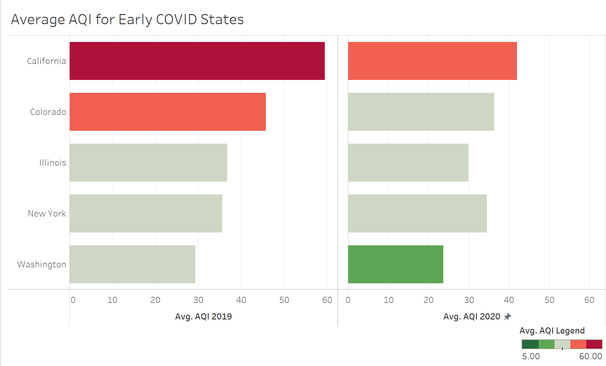

# Class Objectives - Descriptions, Photos, and Links   
      
## Objective 1  
**Install and Run Tableau: Install Tableau Desktop and be able to create, open, save, and share a workbook.**  
In Tableau Lab 1, I loaded the data in, made a simple visual out of it (sum of sales by category) and saved the workbook.  

  

[Download Lab 1](./tableau_workbooks/Lab1.twbx)  

## Objective 2  
**Add data to Tableau workbook: Bring a variety of data sources into Tableau and utilize basic data processing in Tableau**  
In Tableau Lab 2, I loaded data into Tableau and created an `inner join` on the data. This allowed me to pull the two tables -- Dealers and Transactions -- together to display more comprehensive graphs.  
  
  
[Download Lab 2](./tableau_workbooks/Lab2.twbx) 

## Objective 3  
**Create basic visualizations: Use Tableau to create a variety of visualizations as appropriate to for the data being used.**  
In Tableau Lab 3, I used a [police fatal shootings dataset](https://www.kaggle.com/andrewmvd/police-deadly-force-usage-us?select=fatal-police-shootings-data.csv) from Kaggle. This data includes demographic information about the victim (race, gender, age, mental illnesses, etc) as well as information about the shooting (did the victim have a weapon, was the officer wearing a body cam, etc). I thought that the victim's race and what weapon they had would be interesting, so I created visualizations below to clearly display this information. 
  
  
  
[Download Lab 3](./tableau_workbooks/Lab3.twbx)  

## Objective 4  
**Perform calculations in Tableau: Calculate fields and create functions in Tableau**  
For this lab, I used data on [CO2 Emissions by state](https://www.eia.gov/environment/emissions/state/) from the U.S. Energy Information Administration. Because CO2 stays in the environment for a long period of time, it makes the most sense to compare cumulative emissions by state. In the image below, I show the `field calculation` that I created (sum of CO2 Emissions by State from 2010 to 2017), and a glimpse at a possible graph that we can make to compare emissions by state over the last 7 years.  
   
  
[Download Lab 4 ("CO2_Emissions_byState.twbx") ](./tableau_workbooks/CO2_Emissions_byState.twbx)  

## Objective 5  
**Work with tables in Tableau: Be able to create and process table calculations in Tableau**  
For this lab, I created a `parameter` called "Years to Show" and a related `Calculated Field` called "ShareLabels" which only displays the first n years of data, where n is equal to "Years to Show". I added a `slider` to the first graph (shown below) which allows the user to change the Years to Show parameter and choose how many data points she or he wants in the view. In the following three worksheets, I did further analysis to determine which regions and which departments needed the most attention. You can see my rationale [in this document](./documents/Lab5_Description.pdf), but my analysis leads me to believe that Departments G and H of the Western Division and Department F of the Midwestern division need the most attention.    
  
  

[Download Lab 5](./tableau_workbooks/Lab5.twbx)  
 
## Objective 6  
**Create maps in Tableau: Use Tableau to do basic geospatial analysis.**  
My work for this lab shows the Average AQI by month in 2019, with a `slider` to choose a specific month or all months. I made sure to set the legend/color scheme to a static range so that it does not change as we change the filter. If the scale were to change at each month, I don’t believe this interactive display would show any valuable information. However, with a static range, this worksheet shows how the air quality of the United States changes throughout the calendar year. It also shows how individual states compare to those around them and whether they follow trends throughout the year, which could help us find the right questions to ask for further analysis. This information about how air quality changes over space and time could be valuable, and is best displayed through a map like this one.  
  
[Download Lab6](./tableau_workbooks/Lab6.twbx) or [Read the Description](./documents/Lab6_Description.pdf)

## Objective 7
**Mapping with ArcGIS online: Use the online version of ESRI's ArcGIS for basic geospatial processing.**  
In the maps below, I display the mean Air Quality Index (AQI) in the United States for March-May 2019 with March-May 2020. In ArcGIS, I used the `interpolate` feature to expand this data across the United States. Using this, I was able to estimate air quality in locations for which we have no data.    

[See my Air Quality Map Online](https://arcg.is/1rHu98)   
**Spring 2019 AQI:**  
  
**Spring 2020 AQI:**  
  

## Objective 8  
**Do statistical analysis in Tableau: Use Tableau for basic statistical analysis**      
In the first tab (Square Feet Confidence Interval), I see that the average square feet for houses with attached garages is much higher than square feet for houses with detached or no garage. This offers a possible reason why houses with attached garages had a higher sold price, and confirms our hunch that there were confounding factors behind our previous graph, which showed that attached garages correlated with higher prices.

In addition, we see some counties which would likely have a small `p-value` if we ran a significance test - notably, Milwaukee and Ozaukee are outside of the confidence interval for attached garages; Kenosha, Racine, and Walworth are out of the confidence interval for detached; and Washington is well above the confidence interval for the no garage category. The `95% confidence interval` tool in Tableau helps us to visualize and estimate a significance test.  

Another feature of this workbook is that we can filter by year - using this capability, we can see whether some counties may differ from the mean in one year and not the others, or compare how the distance from the mean of individual counties may change year to year. Below is a picture of this workbook with all years (2005 - 2010) selected.  

  
[Download Lab8](./tableau_workbooks/Lab8.twbx)  

## Objective 9  
**Create Interactive Dashboards: Use Tableau to create a dashboard.** 
In this lab, I created a `dashboard` which allows users to investigate the average odometer reading by location and year. The user can filter the data using the map in the bottom left or the table in the bottom right, and it will update the averages in the bar chart on top. This dashboard is useful also because it displays the count of observations in each year and in each region. For example, if there were a subset of data with only a few extreme values that were skewing the data, this dashboard would reveal that.  

  
[Download Lab 9](./tableau_workbooks/Lab9.twbx)    

## Objective 11  
**Clean and prepare data for Tableau: Clean and combine data in Tableau to prepare it for analysis. This will include some basic database concepts**   
For my final project, I had two datasets - AQI for 2019 and AQI 2020. I first combined this data by creating a `union`, which essentially appended the 2020 data to the 2019 data. This option worked well because the two datasets had the same columns. While this method was effective for my analysis, I noticed that there were many more observations in the 2019 data than there were in the 2020 data. In order to account for this imbalance, I created another Tableau workbook, and decided that I would only consider the counties that had data in both 2019 and 2020 to see if the AQI was different. In order to achieve this goal, I created an `inner join` on the two datasets with the State Code and County Code as the primary keys. Download the files below to inspect both methods of data combination and how I applied them to this dataset.  
  
  
[Download Final Project Tableau File 1](./tableau_workbooks/Final_Project.twbx)   
[Download Final Project Tableau File 2](./tableau_workbooks/Final_Joined.twbx)  

## Objective 12
**Using alternate tools: Everything that we do can be done with other software. Demonstrate that by using both Tableau and another tool to produce/process the same visualization**   
In this Lab, I replicated my Lab 3 visualization using Excel. I created a bar chart displaying the frequency of each race in the dataset. As Lab 3 did, this visualization compares fatal police shooting occurence by race of the victim. 

  
[Download Lab 7 - "fatal-police-shootings.xlsx"](./documents/fatal-police-shootings.xlsx)  

## Objective 13  
**Demonstrate an understanding of data context.**  
Final Project - "Has Air Quality Improved since the COVID-19 Pandemic?"   

In this project, I had to consider the data context very seriously. I tackled this dataset in a larger project, and my team and I spent a lot of our time considering the context, impact, and consequences of our research. We had to consider the time period we are in, what the AQI measures, and whether these pollutants are significant or if the changes are notable. One example of the data context that I considered is the pollutants that are included in the AQI measurement: sulfur dioxide, nitrogen dioxide, particle pollution (PM10 and PM2.5), carbon monoxide, and ground-level ozone. The context of these pollutions is that they are short-term, meaning that they only stay in the air for a few minutes, hours or days. When compared to long-term pollutants such as CO2, a dip in pollution from these pollutants does not look quite as promising. For more information about our research project, see the repos [here](https://github.com/baileywellen/COVID-environmental-impact/).  
  
[Watch my Project Presentation on Youtube](https://youtu.be/pEjmn405S2U)  
[Download Final Project Tableau File 1](./tableau_workbooks/Final_Project.twbx)  
[Download Final Project Tableau File 2](./tableau_workbooks/Final_Joined.twbx)  

## Objective 14  
**Choose an appropriate and effective visual**  
The graph shown below is an effective visual for the point that I was trying to prove in my final project - that AQI is lower in 2020 than it was in 2019. In this visualization, you can clearly see that the line for 2019 is higher than that of 2020 at all times. Furthermore, these lines are being compared at the same time of year (January 2019 is compared to January 2020, February 2019 is compared to February 2020, etc), so we know that temperature and seasonal changes are not to blame for this decrease. I believe that the layout of this visualization is effective in conveying this message to my audience.   

  
*See Final Project Links in Objective 13*   

## Objective 15  
**Minimize clutter and focus the audience attention.**  
I took several steps to minimize clutter in the graph below, which I created for my final project.  
First, I hid the x-axis label, which previously said "MONTH(Date)". I found  this label to be unhelpful because the visualization speaks for itself - the separation of year on the top, along with the months on the bottom, make it clear that it is displaying the month.  
Next, I removed the lines on the graph. The point of this graph is not to know the exact AQI of each month, but to notice the difference between 2019 and 2020. For this purpose, the gridlines or reference lines are unhelpful. Instead, taking out the lines helps to focus the audience attention on the difference between the two years' averages rather than distracting them with extra lines.

  
*See Final Project Links in Objective 13*     

## Objective 16   
**Apply elements of design to visualization.**   
In the below graph, I applied elements of design by minimizing clutter and choosing colors strategically. I removed all axis labels because the were unnecessary, and then I chose colors that coordinated with the EPA's designations of healthy -> hazardous air quality. The choice to stay on-brand with the EPA was strategic and displays an element of design. The range of green to red will not only help individuals who are familiar with the AQI chart, but are also consistent with a typical belief that green means good and red means bad.  

  
*See Final Project Links in Objective 13*   
 
