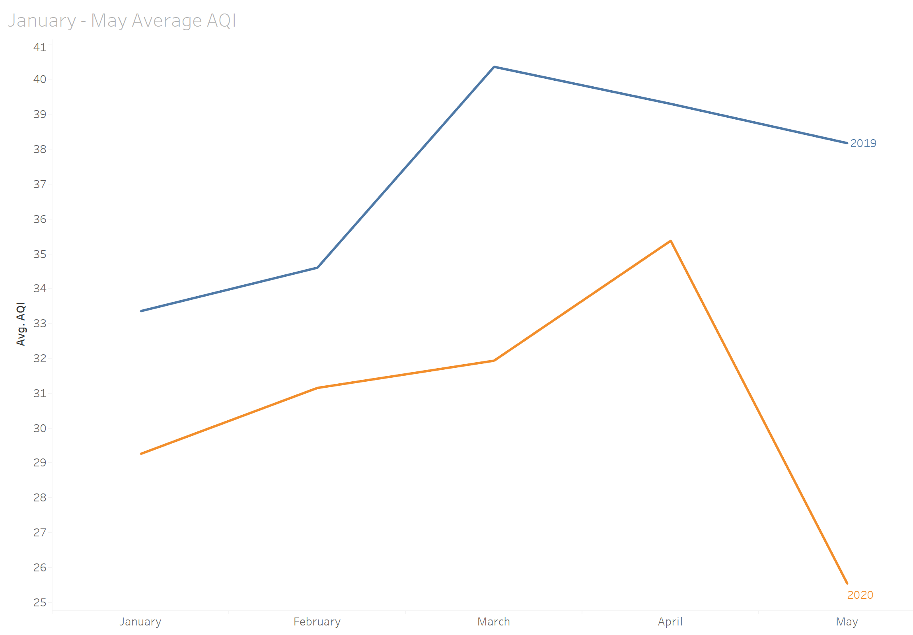

# Data_Visualization
**Portfolio displaying projects completed in an undergraduate course, "Business Geographics and Data Visualization". Tools include Tableau, ArcGIS, and more.**   
  
*Note - Tableau Files cannot be previewed in Github. See the Project descriptions below, but to view the data analysis, you must download the .twb or .twbx files* 

  
## Objectives Met:  16 / 17
**1. Install and Run Tableau: Install Tableau Desktop and be able to create, open, save, and share a workbook.**   
[Download Lab1](./Lab1.twbx)  

**2. Add data to Tableau workbook: Bring a variety of data sources into Tableau and utilize basic data processing in Tableau**    
[Download Lab2](./Lab2.twbx) 

**3. Create basic visualizations: Use Tableau to create a variety of visualizations as appropriate to for the data being used.**  
[Download Lab3](./Lab3.twbx) 

**4. Perform calculations in Tableau: Calculate fields and create functions in Tableau**    
[Download Lab4 ("CO2_Emissions_byState.twbx") ](./CO2_Emissions_byState.twbx)  

**5. Work with tables in Tableau: Be able to create and process table calculations in Tableau**     
[Download Lab5](./Lab5.twbx)  

**6. Create maps in Tableau: Use Tableau to do basic geospatial analysis.**    
[Download Lab6](./Lab6.twbx) or [Read the Description](./Lab6_Description.pdf)

**7. Mapping with ArcGIS online: Use the online version of ESRI's ArcGIS for basic geospatial processing.**   
[See my Air Quality Map Online](https://arcg.is/1rHu98)  

**8. Do statistical analysis in Tableau: Use Tableau for basic statistical analysis**   
In the first tab (Square Feet Confidence Interval), I see that the average square feet for houses with attached garages is much higher than square feet for houses with detached or no garage. This offers a possible reason why houses with attached garages had a higher sold price, and confirms our hunch that there were confounding factors behind our previous graph.

In addition, we see some counties which would likely have a small p value if we ran a significance test - notably, Milwaukee and Ozaukee are outside of the confidence interval for attached garages; Kenosha, Racine, and Walworth are out of the confidence interval for detached; and Washington is well above the confidence interval for the no garage category.   
[Download Lab8](./Lab8.twbx)  

**9. Create Interactive Dashboards: Use Tableau to create a dashboard**    
[Download Lab 9](./Lab9.twbx)    

**10. Publish data visualizations with Tableau: Use Tableau to make visualizations available to the public**    
None so far  

**11. Clean and prepare data for Tableau: Clean and combine data in Tableau to prepare it for analysis. This will include some basic database concepts**   
[See in class workbook](./InClass9-28.twbx)  

**12. Using alternate tools: Everything that we do can be done with other software. Demonstrate that by using both Tableau and another tool to produce/process the same visualization (Due to T6-Alt, ArcGIS online is NOT eligible for this objective).**     
[See Lab7 - "fatal-police-shootings.xlsx"](./fatal-police-shootings.xlsx)  

**13. Demonstrate an understanding of data context.**  
Final Project - "Has Air Quality Improved since the COVID-19 Pandemic?"  
[Watch my Project Presentation on Youtube](https://youtu.be/pEjmn405S2U)  
[Download Final Project Tableau File 1](./Final_Project.twbx)  
[Download Final Project Tableau File 2](./Final_Joined.twbx)  

**14. Choose an appropriate and effective visual**  
  
*See Final Project in Objective 13*   

**15. Minimize clutter and focus the audience attention.**   
*See Final Project in Objective 13*     

**16. Apply elements of design to visualization**  
*See Final Project in Objective 13*   
 
**17. Create a data-based story**  
None so far 
